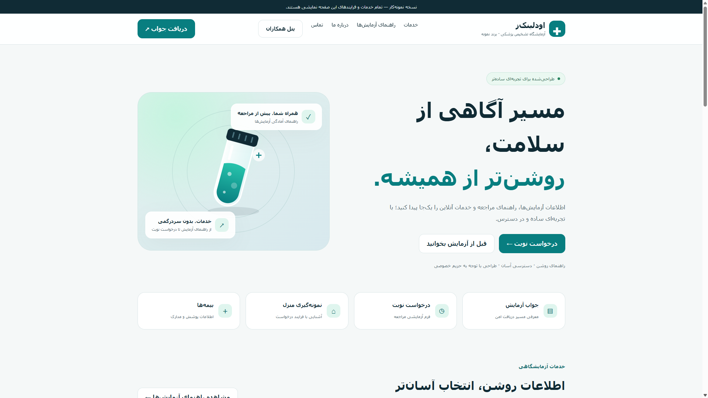

# ODLINKZ

وب‌سایت مفهومی اودلینک‌ز؛ یک پروژه نمونه‌کار برای طراحی و توسعه
رابط کاربری آزمایشگاه تشخیص پزشکی.

## درباره پروژه

این پروژه با هدف نمایش یک تجربه فارسی، راست‌چین و واکنش‌گرا
برای خدمات آزمایشگاهی طراحی شده است.

## امکانات

- طراحی فارسی و راست‌چین
- نمایش مناسب در موبایل و دسکتاپ
- جست‌وجوی آزمایش‌ها
- نمایش راهنمای آمادگی آزمایش
- فرم نمایشی درخواست نوبت
- فرم نمایشی نمونه‌گیری در منزل
- پیش‌نمایش مسیر دریافت جواب
- پرسش‌های متداول

## فناوری‌ها

- HTML
- CSS
- JavaScript

## اجرای محلی

فایل ODLINK-AI.html را با یک مرورگر به‌روز باز کنید.

## وضعیت پروژه

این پروژه صرفاً یک نمونه فرانت‌اند است.

هیچ نوبت واقعی ثبت نمی‌شود، پیامکی ارسال نمی‌شود و سایت به
اطلاعات پزشکی یا سامانه آزمایشگاه متصل نیست.

نام مجموعه و اطلاعات خدمات، نمونه هستند.

## نسخه‌ها

- v1.0.0: نسخه اولیه رابط کاربری

[مشاهده نسخه آنلاین](https://aliz01dev.github.io/ODLINKZ/)

## پیش‌نمایش نسخه اول

